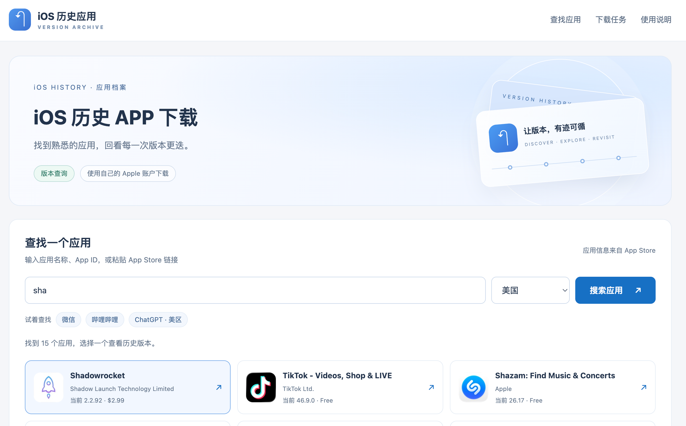
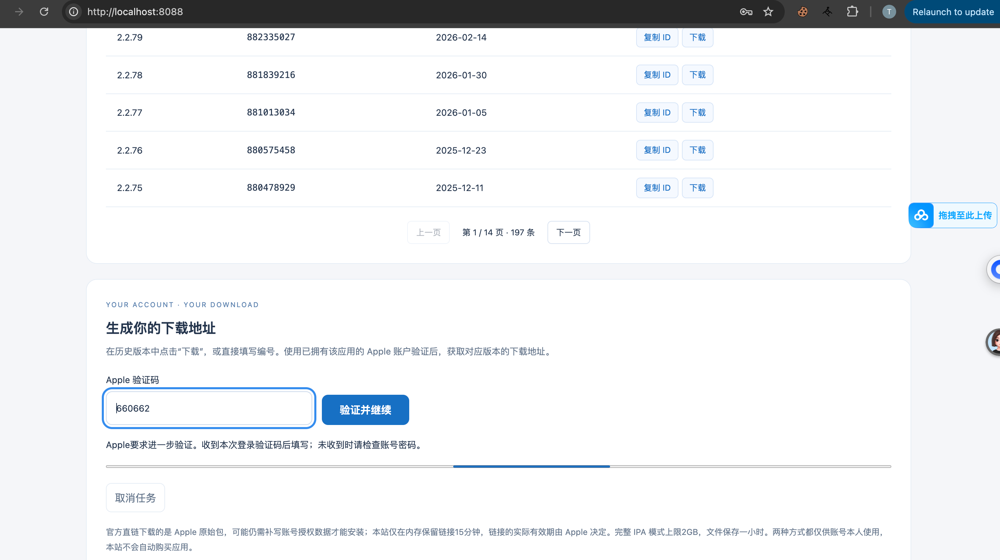
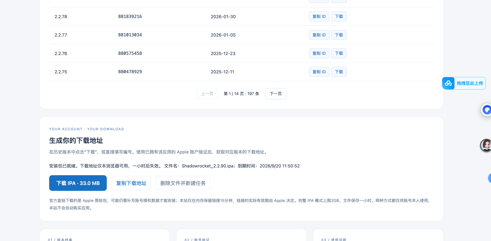
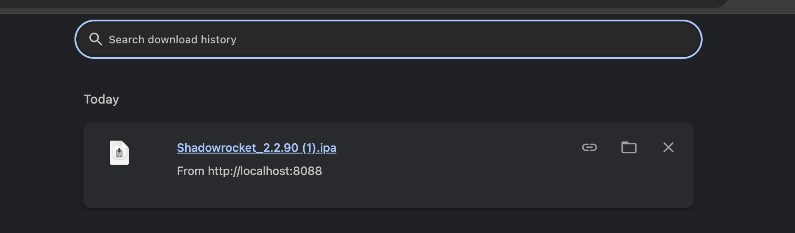
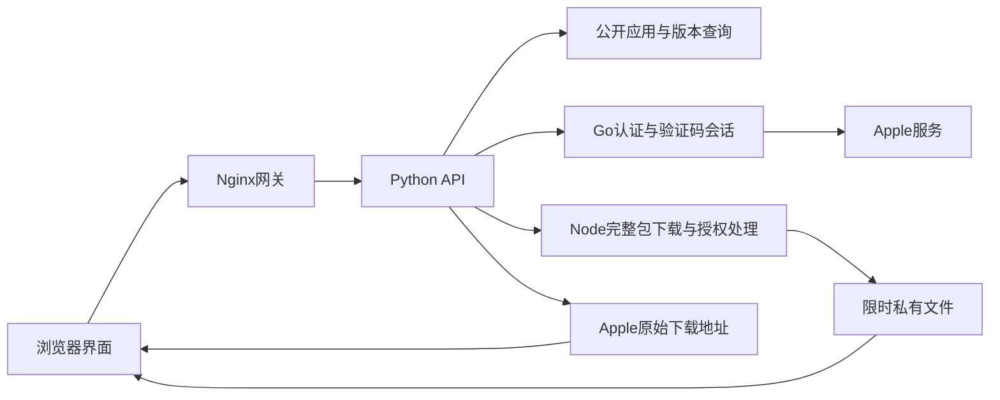

# iOS 历史应用

独立的应用搜索、历史版本查询和Apple账户下载工具。包含完整Web界面、API、交互式CLI，以及可在常见宿主系统上运行的Linux Docker镜像。

不依赖WordPress、原网站、原项目目录或宿主机上的Pastel应用。项目目录沿用指定名称 `ios_histroy_app`。

## 线上预览

**[97学习网 · iOS 历史 APP 下载](https://97study.com/ios-apps)**

可在线体验应用搜索、历史版本查询和账号下载流程。也可以使用下方 Docker 命令独立部署。

## 界面截图

### 应用搜索

选择 App Store 地区，搜索应用并查看历史版本。



<details>
<summary>查看验证码验证、安装包生成与下载完成截图</summary>

### 验证码验证

提交账号密码后，只有 Apple 要求进一步验证时才显示验证码输入。截图展示一次验证过程。



### 安装包就绪

使用自己的 Apple 账户验证后，页面提供安装包名称、大小及限时下载入口。



### 下载完成

安装包按应用名称和版本号命名，便于保存和识别。



</details>

## 启动

安装并启动Docker及Docker Compose，在此目录运行：

```sh
docker compose up -d --build
```

浏览器打开 [http://localhost:8088/](http://localhost:8088/)。Windows PowerShell、macOS终端、Linux终端使用相同命令；默认配置无需额外`.env`文件。

停止服务但保留数据：

```sh
docker compose down
```

`docker compose down -v`会额外删除数据卷、设备标识和缓存，不用于普通停止。

## 包含的功能

- 应用名称、App ID或App Store链接搜索，支持57个国家和地区的商店选择，每次查询一个地区。
- Timbrd、Agzy、Bilin公开历史版本查询；版本筛选、分页、复制ID、一键带入下载表单。
- 输入账号密码后先登录，只有Apple要求时才询问验证码；两步复用同一认证进程、Cookie和SAP签名会话。
- **官方直链**：仅获取并检查Apple原始包地址，不下载或保存完整IPA。链接记录只在内存保留15分钟，Apple决定实际有效期；原始包可能还需补写授权数据才能安装。
- **完整IPA**：在临时目录下载、校验并写入账号授权数据；网页提供限时链接，文件名为“应用名_实际版本号.ipa”，支持断点下载，1小时后清理。
- 账号信息由浏览器加密后提交；同一浏览器会话才能访问其任务与完整包。不会自动购买应用，不把“未取得许可”直接等同于“用户未购买”。

## 系统支持范围

| 宿主机 | 运行方式 |
|---|---|
| Windows x64/ARM64 | 能运行对应架构Linux容器的Docker环境；Docker Desktop须使用Linux容器模式 |
| macOS Intel / Apple Silicon | Docker Desktop，分别使用linux/amd64或linux/arm64 |
| Linux x86-64 / ARM64 | Docker Engine与Compose插件，本机架构构建 |

本项目提供 **linux/amd64、linux/arm64** 镜像构建能力，不提供Windows容器或32位ARM/x86镜像。“跨系统”指宿主机支持Docker的Linux容器，不代表任意内核和CPU都能运行。

已在当前Mac的Docker环境构建并运行两个Linux架构。原生Windows宿主机尚未单独测试；具体测试范围见 [验证记录](docs/VERIFICATION.md)。宿主机无需安装Python、Node、Go或Mac私有框架。

## 配置与公网部署

默认只监听本机 `127.0.0.1:8088`。需要修改端口/域名时复制 `.env.example` 为 `.env`，修改 `HTTP_PORT` 和匹配的 `PUBLIC_ORIGIN`。

- 本机允许 `http://localhost:<端口>`、`http://127.0.0.1:<端口>`、HTTP IPv6 loopback；浏览器需支持WebCrypto。
- 公网域名或局域网IP必须使用HTTPS，配置 `PUBLIC_ORIGIN=https://你的域名`，由已有Nginx/Caddy/Traefik提供TLS；示例见 [部署说明](docs/DEPLOYMENT.md)。
- 不要把Apple ID、密码、验证码或Apple令牌写进`.env`、Compose、命令行参数或日志。
- 首次构建需访问GitHub、Docker镜像仓库、npm及Go依赖源；首次认证准备还需访问Apple签名资源与PyPI上的固定Unicorn运行库。相关源码版本与校验和已固定，仓库只保存`dependencies/`版本与校验清单，第三方源码在构建时下载至被Git忽略的`.runtime/`。

## 运维与验证

```sh
docker compose ps
docker compose logs --tail 50 app
docker compose exec app python3 ios_download.py --check
docker compose exec app python3 ios_download.py --prepare-auth
docker compose exec app python3 -m unittest discover -s tests -v
```

`--prepare-auth`会下载并校验公共签名资源、执行真实SAP握手及测试数据签名，不提交Apple ID或密码。首次可能需要几分钟。

默认单个处理任务并发，完整包上限2GB，文件总配额约8GB；默认要求磁盘余量8GB，可通过`MIN_FREE_GB`调整。认证等待10分钟、处理最长30分钟；服务运行时清理过期数据，重启时过滤过期/未完成任务。

数据使用Compose命名卷保存，源代码目录不包含运行密钥或IPA。升级前应等待当前认证/下载任务结束。API详细接口、加密协议和返回值见 [API文档](docs/API.md)。

## 项目结构

```text
app/                 API、独立目录查询、静态页面服务
web/                 HTML/CSS/JavaScript界面
bridge/              Go认证、Node下载/授权处理及构建适配器
dependencies/        上游固定版本与SHA256清单（不含源码）
licenses/            第三方许可文本
tests/               查询、会话、验证码、下载和权限回归测试
docker/              非root Nginx网关配置
ios_download.py      可选交互式CLI
Dockerfile           多阶段构建
compose.yaml         一键启动
docs/                API、部署、验证与来源说明
```



第三方授权与提取来源见 [THIRD_PARTY_NOTICES.md](THIRD_PARTY_NOTICES.md)。真实下载仍受Apple账号许可、商店地区、版本可用性与网络影响；自动化测试中的合成IPA不代表真实账号登录或设备安装验证。

商店地区下拉框现提供 57 个国家/地区，按区域分组，每次只查询所选商店。包括韩国、英国、加拿大、澳大利亚、马来西亚、土耳其等。切换地区会重新查询；历史版本库本身不按地区划分。

## 开源许可与鸣谢

本项目自有代码采用 [MIT License](LICENSE)；第三方部分继续使用原许可，详见 [第三方声明](THIRD_PARTY_NOTICES.md)。

感谢以下项目提供的协议研究与底层实现：

- [EEliberto/Pastel-macOS](https://github.com/EEliberto/Pastel-macOS)
- [majd/ipatool](https://github.com/majd/ipatool)

仓库不内置这两个项目的源码或压缩包。构建会按固定提交下载并核验 SHA256；生成的 Docker 镜像仍包含运行所需依赖及许可证。不要上传 `.runtime/`、`.env`、下载的 IPA 或 Docker 数据卷。
